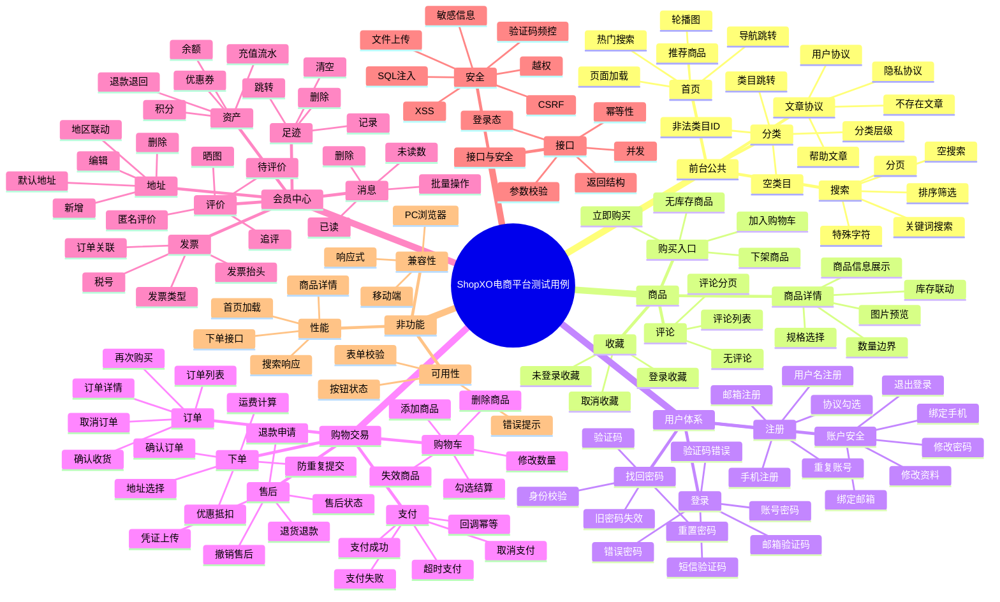

# ShopXO 电商平台测试用例

## 1. 测试用例思维导图

## 2. 测试用例明细

### 2.1 首页与导航

| 用例ID | 模块 | 测试点 | 前置条件 | 操作步骤 | 预期结果 | 优先级 |
| --- | --- | --- | --- | --- | --- | --- |
| TC-HOME-001 | 首页 | 首页正常加载 | 无 | 打开 `http://49.235.61.184/` | 页面 HTTP 200，标题、导航、商品模块、底部信息正常展示 | P0 |
| TC-HOME-002 | 首页 | 轮播图切换 | 首页可访问 | 点击轮播左右切换或圆点 | 图片正常切换，点击图片跳转到配置链接 | P1 |
| TC-HOME-003 | 首页 | 导航跳转 | 首页可访问 | 点击首页、分类、订单、购物车、登录、注册等入口 | 跳转到对应页面；需登录页面应引导登录 | P0 |
| TC-HOME-004 | 首页 | 热门搜索词 | 首页可访问 | 点击热门搜索词，如“手机”“电脑” | 进入搜索结果页，关键词或结果匹配 | P1 |
| TC-HOME-005 | 首页 | 推荐商品跳转 | 首页有商品 | 点击任一推荐商品 | 进入对应商品详情页，商品 ID 与标题匹配 | P0 |
| TC-HOME-006 | 首页 | 资源加载 | 首页可访问 | 打开开发者工具或抓包查看图片/CSS/JS | 静态资源无 404，核心 JS 无明显报错 | P1 |

### 2.2 分类与搜索

| 用例ID | 模块 | 测试点 | 前置条件 | 操作步骤 | 预期结果 | 优先级 |
| --- | --- | --- | --- | --- | --- | --- |
| TC-CAT-001 | 分类 | 分类页加载 | 无 | 打开 `/?s=category/index.html` | 分类页正常展示多级类目 | P0 |
| TC-CAT-002 | 分类 | 一级类目跳转 | 分类页可访问 | 点击一级类目 | 跳转搜索列表或展开子类目，类目名称正确 | P1 |
| TC-CAT-003 | 分类 | 子类目跳转 | 分类页可访问 | 点击二级/三级类目 | 进入对应类目商品列表 | P1 |
| TC-CAT-004 | 分类 | 非法类目 ID | 无 | 访问 `/?s=search/index/cid/999999.html` | 页面不报错，展示无数据或友好提示 | P1 |
| TC-SEARCH-001 | 搜索 | 关键词搜索 | 无 | 搜索“手机” | 展示与手机相关商品，搜索条件生效 | P0 |
| TC-SEARCH-002 | 搜索 | 空关键词搜索 | 无 | 搜索框为空时提交 | 不出现系统异常，按产品规则展示全部或提示输入关键词 | P1 |
| TC-SEARCH-003 | 搜索 | 特殊字符搜索 | 无 | 输入 `` 搜索 | 页面不执行脚本，不出现 SQL/系统错误 | P0 |
| TC-SEARCH-004 | 搜索 | 超长关键词 | 无 | 输入 256 位以上字符搜索 | 有长度限制或友好提示，服务端不异常 | P1 |
| TC-SEARCH-005 | 搜索 | 分页 | 搜索结果多页 | 点击下一页、末页、指定页码 | 分页正确，结果不重复或丢失 | P1 |
| TC-SEARCH-006 | 搜索 | 排序筛选 | 搜索页存在排序 | 切换价格、销量、新品等排序 | 商品顺序符合排序规则 | P2 |

### 2.3 商品详情

| 用例ID | 模块 | 测试点 | 前置条件 | 操作步骤 | 预期结果 | 优先级 |
| --- | --- | --- | --- | --- | --- | --- |
| TC-GOODS-001 | 商品详情 | 商品详情加载 | 存在商品 | 打开 `/?s=goods/index/id/99.html` | 商品标题、图片、价格、库存、按钮正常展示 | P0 |
| TC-GOODS-002 | 商品详情 | 图片预览 | 商品有多图 | 点击商品缩略图或主图 | 主图切换或预览正常，无图片破损 | P1 |
| TC-GOODS-003 | 商品详情 | 规格选择 | 商品有规格 | 选择不同规格 | 价格、库存、购买按钮状态联动正确 | P0 |
| TC-GOODS-004 | 商品详情 | 未选规格购买 | 商品有必选规格 | 不选规格点击加入购物车/立即购买 | 提示选择规格，不能提交 | P0 |
| TC-GOODS-005 | 商品详情 | 数量为空 | 商品详情页 | 清空购买数量后提交 | 提示请输入购买数量 | P1 |
| TC-GOODS-006 | 商品详情 | 数量为 0/负数 | 商品详情页 | 输入 0 或 -1 后提交 | 提示数量非法，不能提交 | P1 |
| TC-GOODS-007 | 商品详情 | 数量超库存 | 商品库存有限 | 输入大于库存的数量 | 提示库存不足或自动限制最大值 | P0 |
| TC-GOODS-008 | 商品详情 | 评论列表 | 商品详情页 | 点击评论 tab | 评论接口返回成功，有数据展示列表，无数据展示空状态 | P1 |
| TC-GOODS-009 | 商品详情 | 商品不存在 | 无 | 访问不存在商品 ID | 展示“商品不存在或已删除”等友好提示 | P1 |
| TC-GOODS-010 | 商品详情 | 下架/无库存商品 | 准备下架或无库存商品 | 尝试加购或购买 | 购买入口禁用或提示不可购买 | P0 |

### 2.4 注册、登录、找回密码

| 用例ID | 模块 | 测试点 | 前置条件 | 操作步骤 | 预期结果 | 优先级 |
| --- | --- | --- | --- | --- | --- | --- |
| TC-USER-001 | 注册 | 用户名注册成功 | 未注册账号 | 输入合法账号、密码、验证码，勾选协议提交 | 注册成功并可登录或进入下一步 | P0 |
| TC-USER-002 | 注册 | 手机号注册 | 可接收短信 | 输入手机号，获取验证码并提交 | 手机号注册成功，验证码只能使用一次 | P0 |
| TC-USER-003 | 注册 | 邮箱注册 | 可接收邮件 | 输入邮箱，获取验证码并提交 | 邮箱注册成功，验证码有效期正确 | P1 |
| TC-USER-004 | 注册 | 未勾选协议 | 注册页 | 填写合法信息但不勾选协议 | 阻止提交并提示同意协议 | P0 |
| TC-USER-005 | 注册 | 重复账号 | 账号已存在 | 使用已注册账号提交注册 | 提示账号已存在 | P0 |
| TC-USER-006 | 注册 | 密码长度边界 | 注册页 | 输入少于 6 位或超过 18 位密码 | 提示密码格式错误 | P1 |
| TC-LOGIN-001 | 登录 | 账号密码登录成功 | 有效账号 | 输入正确账号、密码、验证码登录 | 登录成功，顶部展示用户信息 | P0 |
| TC-LOGIN-002 | 登录 | 错误密码 | 有效账号 | 输入错误密码登录 | 登录失败，提示账号或密码错误 | P0 |
| TC-LOGIN-003 | 登录 | 图形验证码错误 | 登录页 | 输入错误图形验证码 | 登录失败，提示验证码错误 | P0 |
| TC-LOGIN-004 | 登录 | 短信登录 | 已绑定手机号 | 获取短信验证码后登录 | 登录成功，验证码失效 | P1 |
| TC-LOGIN-005 | 登录 | 邮箱登录 | 已绑定邮箱 | 获取邮箱验证码后登录 | 登录成功，验证码失效 | P1 |
| TC-LOGIN-006 | 登录 | 验证码频控 | 登录页 | 短时间多次发送短信/邮箱验证码 | 触发倒计时或频率限制 | P0 |
| TC-PWD-001 | 找回密码 | 找回密码成功 | 有效账号 | 进入找回密码，验证身份并设置新密码 | 新密码可登录，旧密码失效 | P0 |
| TC-PWD-002 | 找回密码 | 验证码过期 | 有效账号 | 使用过期验证码重置密码 | 重置失败并提示验证码失效 | P1 |

### 2.5 会员中心与账户安全

| 用例ID | 模块 | 测试点 | 前置条件 | 操作步骤 | 预期结果 | 优先级 |
| --- | --- | --- | --- | --- | --- | --- |
| TC-MEMBER-001 | 用户中心 | 用户中心加载 | 已登录 | 打开 `/?s=user/index.html` | 页面正常展示用户信息、订单、资产、消息等入口 | P0 |
| TC-MEMBER-002 | 用户中心 | 未登录拦截 | 未登录 | 访问用户中心 | 跳转登录页或弹出登录提示 | P0 |
| TC-MEMBER-003 | 个人资料 | 修改昵称 | 已登录 | 修改昵称并保存 | 保存成功，刷新后仍显示新昵称 | P1 |
| TC-MEMBER-004 | 个人资料 | 昵称 XSS | 已登录 | 昵称输入 `` | 脚本不执行，内容被过滤或转义 | P0 |
| TC-MEMBER-005 | 头像 | 上传头像 | 已登录 | 上传合法图片 | 上传成功，头像更新 | P1 |
| TC-MEMBER-006 | 密码 | 修改密码成功 | 已登录 | 输入原密码、新密码、确认密码提交 | 修改成功，旧密码不可登录 | P0 |
| TC-MEMBER-007 | 密码 | 原密码错误 | 已登录 | 输入错误原密码提交 | 修改失败并提示原密码错误 | P0 |
| TC-MEMBER-008 | 绑定 | 手机/邮箱换绑 | 已登录 | 验证旧账号后绑定新手机号/邮箱 | 换绑成功，新联系方式可用于登录或验证 | P1 |
| TC-MEMBER-009 | 退出 | 退出登录 | 已登录 | 点击退出登录后访问用户中心 | 退出成功，再访问需重新登录 | P0 |

### 2.6 地址管理

| 用例ID | 模块 | 测试点 | 前置条件 | 操作步骤 | 预期结果 | 优先级 |
| --- | --- | --- | --- | --- | --- | --- |
| TC-ADDR-001 | 地址 | 新增地址 | 已登录 | 填写收货人、手机号、省市区、详细地址并保存 | 地址保存成功，列表展示 | P0 |
| TC-ADDR-002 | 地址 | 必填校验 | 已登录 | 关键字段留空保存 | 保存失败并提示必填项 | P1 |
| TC-ADDR-003 | 地址 | 手机号格式 | 已登录 | 输入非法手机号保存 | 保存失败并提示手机号格式错误 | P1 |
| TC-ADDR-004 | 地址 | 设置默认地址 | 已登录且有多个地址 | 将某地址设为默认 | 默认标识唯一，确认订单页自动带出 | P0 |
| TC-ADDR-005 | 地址 | 编辑地址 | 已登录且有地址 | 修改地址信息保存 | 信息更新成功 | P1 |
| TC-ADDR-006 | 地址 | 删除地址 | 已登录且有地址 | 删除地址 | 删除成功，确认订单页不再展示 | P1 |
| TC-ADDR-007 | 地址 | 地址越权 | 两个账号 | 使用账号 A 尝试修改账号 B 地址 ID | 操作被拒绝 | P0 |

### 2.7 购物车

| 用例ID | 模块 | 测试点 | 前置条件 | 操作步骤 | 预期结果 | 优先级 |
| --- | --- | --- | --- | --- | --- | --- |
| TC-CART-001 | 购物车 | 加入购物车 | 已登录，商品可售 | 商品详情点击加入购物车 | 加购成功，购物车数量更新 | P0 |
| TC-CART-002 | 购物车 | 未登录加购 | 未登录 | 点击加入购物车 | 引导登录，不应静默失败 | P0 |
| TC-CART-003 | 购物车 | 重复加购同规格 | 已登录 | 同商品同规格加购两次 | 数量合并或符合产品规则 | P1 |
| TC-CART-004 | 购物车 | 不同规格加购 | 已登录，多规格商品 | 分别选择不同规格加购 | 购物车中分行展示不同规格 | P1 |
| TC-CART-005 | 购物车 | 修改数量 | 购物车有商品 | 修改商品数量 | 小计、总价、库存提示同步更新 | P0 |
| TC-CART-006 | 购物车 | 删除商品 | 购物车有商品 | 删除单个商品 | 商品从购物车移除，总价更新 | P1 |
| TC-CART-007 | 购物车 | 批量删除 | 购物车有多个商品 | 勾选多个商品删除 | 选中商品被删除 | P1 |
| TC-CART-008 | 购物车 | 勾选结算 | 购物车有多个商品 | 勾选部分商品点击结算 | 只结算已勾选商品，金额准确 | P0 |
| TC-CART-009 | 购物车 | 失效商品 | 购物车存在下架商品 | 进入购物车 | 失效商品有提示且不能结算 | P0 |

### 2.8 下单与支付

| 用例ID | 模块 | 测试点 | 前置条件 | 操作步骤 | 预期结果 | 优先级 |
| --- | --- | --- | --- | --- | --- | --- |
| TC-ORDER-001 | 下单 | 购物车结算 | 已登录，购物车有可售商品 | 勾选商品点击结算 | 进入确认订单页 | P0 |
| TC-ORDER-002 | 下单 | 立即购买 | 已登录，商品可售 | 商品详情点击立即购买 | 进入确认订单页，商品信息正确 | P0 |
| TC-ORDER-003 | 下单 | 默认地址带出 | 已登录，有默认地址 | 进入确认订单页 | 默认地址自动选中 | P0 |
| TC-ORDER-004 | 下单 | 无地址下单 | 已登录，无地址 | 进入确认订单页 | 提示新增地址或阻止提交 | P0 |
| TC-ORDER-005 | 下单 | 订单金额计算 | 已登录 | 提交前核对商品金额、运费、优惠、应付 | 金额计算准确 | P0 |
| TC-ORDER-006 | 下单 | 防重复提交 | 已登录 | 快速多次点击提交订单 | 只生成一笔订单或有重复提交防护 | P0 |
| TC-ORDER-007 | 下单 | 库存变化 | 商品库存不足 | 结算时商品库存不足 | 阻止下单并提示库存不足 | P0 |
| TC-PAY-001 | 支付 | 支付成功 | 有待支付订单，测试支付通道 | 完成支付 | 订单变为已支付/待发货，生成支付流水 | P0 |
| TC-PAY-002 | 支付 | 支付失败 | 有待支付订单 | 模拟支付失败 | 订单保持待支付，可重新支付 | P0 |
| TC-PAY-003 | 支付 | 取消支付 | 有待支付订单 | 在支付页取消 | 返回订单页，状态不变 | P1 |
| TC-PAY-004 | 支付 | 支付回调幂等 | 有支付回调能力 | 重复发送同一支付成功回调 | 订单状态只变更一次，金额不重复入账 | P0 |

### 2.9 订单、评价与售后

| 用例ID | 模块 | 测试点 | 前置条件 | 操作步骤 | 预期结果 | 优先级 |
| --- | --- | --- | --- | --- | --- | --- |
| TC-ORDERC-001 | 订单 | 订单列表 | 已登录且有订单 | 打开订单列表 | 按状态展示订单，金额和状态正确 | P0 |
| TC-ORDERC-002 | 订单 | 订单详情 | 已登录且有订单 | 点击订单详情 | 商品、地址、金额、支付、物流信息正确 | P0 |
| TC-ORDERC-003 | 订单 | 取消订单 | 待付款订单 | 点击取消订单并确认 | 订单状态变为已取消，库存按规则回退 | P0 |
| TC-ORDERC-004 | 订单 | 确认收货 | 待收货订单 | 点击确认收货 | 订单变为已完成，可进入评价 | P0 |
| TC-ORDERC-005 | 订单 | 再次购买 | 已完成订单 | 点击再次购买 | 商品加入购物车或进入确认订单页 | P1 |
| TC-ORDERC-006 | 订单 | 订单越权 | 两个账号 | 账号 A 访问账号 B 订单 ID | 拒绝访问或提示无权限 | P0 |
| TC-COMMENT-001 | 评价 | 发表评价 | 已完成待评价订单 | 填写评分、内容提交 | 评价成功，商品评论可见或待审核 | P1 |
| TC-COMMENT-002 | 评价 | 晒图评价 | 已完成待评价订单 | 上传合法图片并评价 | 图片上传成功，评价展示图片 | P1 |
| TC-COMMENT-003 | 评价 | 评价 XSS | 已完成待评价订单 | 评价内容输入脚本 | 脚本不执行，内容被过滤或转义 | P0 |
| TC-AFTER-001 | 售后 | 退款申请 | 可售后订单 | 提交退款原因和金额 | 退款申请成功，状态变为处理中 | P0 |
| TC-AFTER-002 | 售后 | 退款金额边界 | 可售后订单 | 输入超过可退金额 | 阻止提交并提示金额错误 | P0 |
| TC-AFTER-003 | 售后 | 上传凭证 | 可售后订单 | 上传合法图片凭证 | 上传成功并关联售后单 | P1 |
| TC-AFTER-004 | 售后 | 撤销售后 | 售后处理中 | 点击撤销申请 | 售后状态更新，订单恢复对应状态 | P1 |
| TC-AFTER-005 | 售后 | 售后越权 | 两个账号 | 账号 A 访问账号 B 售后单 | 拒绝访问 | P0 |

### 2.10 资产、优惠券与发票

| 用例ID | 模块 | 测试点 | 前置条件 | 操作步骤 | 预期结果 | 优先级 |
| --- | --- | --- | --- | --- | --- | --- |
| TC-ASSET-001 | 资产 | 积分展示 | 已登录 | 打开积分页 | 当前积分、明细、来源展示正确 | P1 |
| TC-ASSET-002 | 资产 | 余额展示 | 已登录 | 打开余额页 | 余额、冻结金额、流水展示正确 | P1 |
| TC-ASSET-003 | 资产 | 余额支付 | 账号有余额 | 下单选择余额抵扣 | 抵扣金额正确，余额流水减少 | P0 |
| TC-ASSET-004 | 资产 | 退款退回 | 余额支付订单退款成功 | 查看余额流水 | 退款金额按规则退回 | P0 |
| TC-COUPON-001 | 优惠券 | 优惠券列表 | 已登录且有券 | 打开优惠券页 | 未使用、已使用、已过期状态正确 | P1 |
| TC-COUPON-002 | 优惠券 | 使用优惠券 | 有可用优惠券 | 下单选择优惠券 | 应付金额减少，订单记录优惠信息 | P0 |
| TC-COUPON-003 | 优惠券 | 不可用优惠券 | 有不满足条件优惠券 | 下单尝试使用 | 不可选择或提示不满足条件 | P0 |
| TC-INVOICE-001 | 发票 | 新增发票抬头 | 已登录 | 新增个人/企业发票抬头 | 保存成功，列表展示 | P1 |
| TC-INVOICE-002 | 发票 | 税号校验 | 已登录 | 企业抬头输入非法税号 | 保存失败或提示格式错误 | P1 |
| TC-INVOICE-003 | 发票 | 订单申请发票 | 已完成订单 | 申请发票并选择抬头 | 发票申请成功并关联订单 | P1 |

### 2.11 消息、收藏与足迹

| 用例ID | 模块 | 测试点 | 前置条件 | 操作步骤 | 预期结果 | 优先级 |
| --- | --- | --- | --- | --- | --- | --- |
| TC-MSG-001 | 消息 | 消息列表 | 已登录且有消息 | 打开消息中心 | 消息类型、标题、时间、已读状态正确 | P1 |
| TC-MSG-002 | 消息 | 标记已读 | 有未读消息 | 点击消息或标记已读 | 未读数减少，状态更新 | P1 |
| TC-MSG-003 | 消息 | 删除消息 | 有消息 | 删除单条或批量删除 | 消息从列表移除 | P2 |
| TC-FAVOR-001 | 收藏 | 收藏商品 | 已登录 | 商品详情点击收藏 | 收藏成功，收藏列表出现该商品 | P1 |
| TC-FAVOR-002 | 收藏 | 取消收藏 | 已收藏商品 | 点击取消收藏 | 收藏状态取消，列表移除 | P1 |
| TC-FAVOR-003 | 收藏 | 收藏失效商品 | 已收藏商品下架 | 打开收藏列表 | 失效商品有明确提示 | P1 |
| TC-FOOT-001 | 足迹 | 浏览记录 | 已登录 | 访问多个商品详情后打开足迹 | 足迹按时间记录访问商品 | P2 |
| TC-FOOT-002 | 足迹 | 删除足迹 | 有足迹 | 删除单条足迹 | 该记录被删除 | P2 |
| TC-FOOT-003 | 足迹 | 清空足迹 | 有多条足迹 | 点击清空 | 足迹列表为空 | P2 |

### 2.12 文章、协议与内容安全

| 用例ID | 模块 | 测试点 | 前置条件 | 操作步骤 | 预期结果 | 优先级 |
| --- | --- | --- | --- | --- | --- | --- |
| TC-ARTICLE-001 | 文章 | 帮助文章访问 | 无 | 打开“如何注册成为会员”等帮助文章 | 标题和正文正常展示 | P1 |
| TC-ARTICLE-002 | 文章 | 用户协议 | 无 | 打开用户注册协议 | 协议内容正常展示 | P1 |
| TC-ARTICLE-003 | 文章 | 隐私协议 | 无 | 打开隐私协议 | 隐私协议内容正常展示 | P1 |
| TC-ARTICLE-004 | 文章 | 不存在文章 | 无 | 访问不存在文章 ID | 友好错误提示，不暴露系统信息 | P1 |
| TC-ARTICLE-005 | 内容安全 | 富文本 XSS | 有可编辑富文本入口 | 提交含脚本的内容并查看 | 脚本不执行，内容被过滤或转义 | P0 |

### 2.13 文件上传

| 用例ID | 模块 | 测试点 | 前置条件 | 操作步骤 | 预期结果 | 优先级 |
| --- | --- | --- | --- | --- | --- | --- |
| TC-UPLOAD-001 | 上传 | 合法图片上传 | 已登录，有上传入口 | 上传 JPG/PNG 图片 | 上传成功，返回可访问图片地址 | P1 |
| TC-UPLOAD-002 | 上传 | 超大文件 | 已登录，有上传入口 | 上传超过限制的图片 | 上传失败并提示文件大小限制 | P0 |
| TC-UPLOAD-003 | 上传 | 非法后缀 | 已登录，有上传入口 | 上传 `.php`、`.html`、`.js` 文件 | 上传失败，文件不落地或不可访问执行 | P0 |
| TC-UPLOAD-004 | 上传 | 双后缀文件 | 已登录，有上传入口 | 上传 `test.jpg.php` | 上传失败或被安全重命名 | P0 |
| TC-UPLOAD-005 | 上传 | MIME 绕过 | 已登录，有上传入口 | 修改 MIME 上传脚本文件 | 服务端识别真实类型并拒绝 | P0 |
| TC-UPLOAD-006 | 上传 | 未登录上传 | 未登录 | 直接请求上传接口 | 拒绝上传或要求登录 | P0 |
| TC-UPLOAD-007 | 上传 | 上传路径泄露 | 已登录 | 触发上传失败 | 错误信息不暴露服务器绝对路径 | P1 |

### 2.14 接口测试

| 用例ID | 模块 | 测试点 | 前置条件 | 操作步骤 | 预期结果 | 优先级 |
| --- | --- | --- | --- | --- | --- | --- |
| TC-API-001 | 接口 | 返回结构 | 无 | 请求已发现接口 | 返回包含统一 `code`、`msg`、`data` 或符合平台规范 | P1 |
| TC-API-002 | 接口 | 缺少参数 | 无 | 请求接口时删除必填参数 | 返回参数错误，不出现 500 | P0 |
| TC-API-003 | 接口 | 参数类型错误 | 无 | 商品 ID 传字符串或数组 | 返回参数错误，不出现 SQL/系统异常 | P0 |
| TC-API-004 | 接口 | 超长参数 | 无 | 传入超长 keyword、备注、地址 | 服务端限制或友好报错 | P1 |
| TC-API-005 | 接口 | 未登录访问 | 未登录 | 请求购物车、收藏、订单等接口 | 返回未登录或跳转登录 | P0 |
| TC-API-006 | 接口 | 会话过期 | 过期 session | 请求登录后接口 | 返回未登录，不继续执行业务操作 | P0 |
| TC-API-007 | 接口 | 重复提交 | 已登录 | 连续提交同一订单/退款请求 | 只生成一条有效记录 | P0 |
| TC-API-008 | 接口 | 并发库存 | 低库存商品 | 多用户同时下单 | 库存不超卖，失败请求有明确提示 | P0 |

### 2.15 安全测试

| 用例ID | 模块 | 测试点 | 前置条件 | 操作步骤 | 预期结果 | 优先级 |
| --- | --- | --- | --- | --- | --- | --- |
| TC-SEC-001 | XSS | 搜索 XSS | 无 | 搜索框输入脚本 payload | 页面不执行脚本 | P0 |
| TC-SEC-002 | XSS | 地址 XSS | 已登录 | 地址字段输入脚本 payload | 保存或展示时被过滤/转义 | P0 |
| TC-SEC-003 | XSS | 评价 XSS | 已登录 | 评价内容输入脚本 payload | 商品评论页不执行脚本 | P0 |
| TC-SEC-004 | SQL 注入 | ID 参数注入 | 无 | 商品/分类/订单 ID 拼接注入 payload | 不返回 SQL 错误，不泄露数据 | P0 |
| TC-SEC-005 | 越权 | 订单越权 | 两个账号 | A 访问或操作 B 的订单 ID | 拒绝访问或无权限提示 | P0 |
| TC-SEC-006 | 越权 | 地址越权 | 两个账号 | A 修改或删除 B 的地址 ID | 操作失败 | P0 |
| TC-SEC-007 | CSRF | 关键操作 CSRF | 已登录 | 构造跨站请求修改地址/收藏/订单 | 请求被 token、referer 或 SameSite 策略拦截 | P0 |
| TC-SEC-008 | 验证码 | 验证码复用 | 有验证码 | 同一验证码重复使用 | 第二次使用失败 | P0 |
| TC-SEC-009 | 敏感信息 | 响应泄露 | 无 | 查看登录、订单、支付响应 | 不泄露密码、验证码、完整支付敏感信息 | P0 |
| TC-SEC-010 | Cookie | Cookie 安全属性 | 登录后 | 查看 Cookie 属性 | 关键 Cookie 建议具备 HttpOnly、SameSite，HTTPS 环境应有 Secure | P1 |

### 2.16 兼容性、性能与可用性

| 用例ID | 模块 | 测试点 | 前置条件 | 操作步骤 | 预期结果 | 优先级 |
| --- | --- | --- | --- | --- | --- | --- |
| TC-NF-001 | 兼容性 | Chrome | 无 | 使用 Chrome 浏览首页、详情、购物车、订单 | 功能和样式正常 | P1 |
| TC-NF-002 | 兼容性 | Edge/Firefox/Safari | 无 | 使用不同浏览器执行冒烟流程 | 无严重兼容问题 | P1 |
| TC-NF-003 | 移动端 | 响应式布局 | 无 | 使用手机视口访问核心页面 | 布局不重叠，按钮可点击 | P1 |
| TC-NF-004 | 性能 | 首页加载 | 无 | 统计首页首屏和总加载时间 | 达到项目性能基线，无大量 404 | P1 |
| TC-NF-005 | 性能 | 搜索响应 | 无 | 连续执行关键词搜索 | 响应时间稳定，无明显超时 | P1 |
| TC-NF-006 | 性能 | 下单接口 | 已登录 | 提交订单并记录响应时间 | 响应在可接受范围内，不重复提交 | P0 |
| TC-NF-007 | 可用性 | 错误提示 | 无 | 触发登录、注册、下单、上传错误 | 提示清晰，可指导用户修正 | P1 |
| TC-NF-008 | 可用性 | 按钮状态 | 无 | 观察提交、加载、禁用、成功状态 | 状态明确，防止重复点击 | P1 |

## 3. 冒烟测试用例集合

| 用例ID | 流程 | 步骤 | 预期结果 |
| --- | --- | --- | --- |
| SMOKE-001 | 游客浏览 | 打开首页 -> 进入分类 -> 搜索商品 -> 打开商品详情 | 全流程页面正常加载 |
| SMOKE-002 | 登录注册 | 注册新用户 -> 登录 -> 进入用户中心 -> 退出登录 | 注册登录退出均成功 |
| SMOKE-003 | 加购结算 | 登录 -> 商品详情选规格 -> 加入购物车 -> 修改数量 -> 结算 | 购物车和确认订单金额正确 |
| SMOKE-004 | 下单支付 | 选择地址 -> 提交订单 -> 测试支付成功/取消 | 订单状态符合支付结果 |
| SMOKE-005 | 订单售后 | 查看订单 -> 取消/确认收货/评价/退款 | 状态流转正确 |
| SMOKE-006 | 会员中心 | 修改资料 -> 新增地址 -> 查看收藏/消息/资产 | 数据保存和展示正确 |

## 4. 执行说明

- P0 为核心链路和高风险用例，必须优先执行。
- 涉及支付、短信、邮箱、退款、余额的用例，需要先确认测试环境隔离和测试数据。
- 涉及越权、安全、上传的用例，应在授权范围内执行，避免破坏生产数据。
- 当前登录后真实菜单仍建议使用有效登录 cookie 或测试账号复核，再根据实际可见入口裁剪用例。
